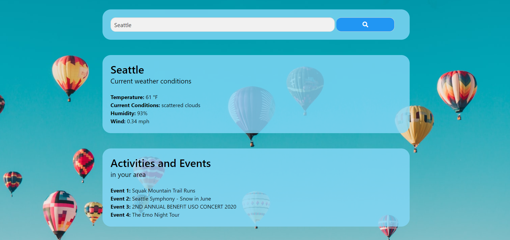

# Weather Event Planner

Deployed Application: https://billyhao12.github.io/Weather-Event-Planner/

## Description

Plan events based on the current weather conditions.

## Table of Contents

* [Usage](#usage)
* [Credits](#credits)
* [License](#license)

## Usage

Type a city name in the search bar to get current weather conditions and events happening in your area.

## Credits

Developed by [Trenton Creamer](https://github.com/trcream), [Eric Gish](https://github.com/EricG442), [Billy Hao](https://github.com/billyhao12) and [Caleb Hay](https://github.com/ICVRXS).

## License

